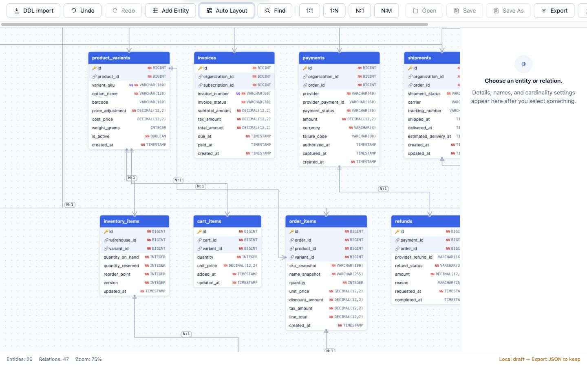

# ERD Studio

ERD Studio is a local-first visual database design tool. Paste MySQL or PostgreSQL DDL, inspect and edit the resulting ER diagram, safely merge incremental DDL, and export the model as SQL, DBML, Mermaid, PNG, or JSON.

> `0.1.0-alpha`: suitable for evaluation and small self-hosted deployments. Back up important work and review generated DDL before applying it to a database.



## Highlights

- Parse `CREATE TABLE`, `ALTER TABLE`, foreign keys, comments, uniqueness, nullability, and auto-increment metadata.
- Smart Merge preserves existing entity IDs, positions, manual relations, and tables outside the incoming DDL.
- Navigate large models with `Cmd/Ctrl+K`, table/column search, keyboard selection, and semantic low-zoom rendering.
- Export PostgreSQL, MySQL, DBML, Mermaid, PNG, and lossless ERD Studio JSON.
- Work entirely in the browser, or add the optional Fastify/SQLite server for shared projects and AI relation suggestions.

The public example in [`examples/marketplace-platform.sql`](examples/marketplace-platform.sql) contains 26 tables, 242 columns, and 47 foreign keys. Its incremental companion adds 2 tables and 5 foreign keys to exercise Smart Merge.

## Quick start

Node.js 20 or 22 is supported.

```bash
git clone <your-fork-url>
cd erd-studio

cd client
npm ci
npm run dev
```

Open `http://localhost:5173`. Without the server, editing/import/export works locally. The status bar shows `Local draft — Export JSON to keep`; server Open/Save and autosave stay disabled.

To enable shared projects:

```bash
cd server
cp .env.example .env
# Set EDIT_PASSWORD locally. Never commit .env.
npm ci
npm run dev
```

Vite proxies `/api` to `http://localhost:3001` during development.

## Security defaults

- Project names and schemas are private by default. Anonymous read access requires the explicit `PROJECT_READ_ACCESS=public` opt-in.
- Editor/admin passwords are never returned as tokens or stored by the browser. Login creates an opaque, hashed, expiring server session and an HttpOnly `SameSite=Strict` cookie.
- Production mode refuses to start without an HTTPS `APP_BASE_URL` and `COOKIE_SECURE=true`.
- State-changing requests require the configured same origin.
- OAuth cookies and editor cookies are separate. Codex provider mode remains loopback-only.

ERD schemas and AI prompts may contain sensitive business information. Read [SECURITY.md](SECURITY.md) and the [server deployment guide](server/README.md) before exposing the app to the internet.

## Verification

```bash
cd client
npm ci
npm run verify
npm audit --audit-level=high

cd ../server
npm ci
npm run typecheck
npm test
npm run build
npm audit --audit-level=high
```

CI runs these checks on Node.js 20 and 22 and also runs CodeQL, secret scanning, and High/Critical dependency gates.

## Supported scope and limitations

- Supported deployment: one Fastify process and one SQLite database behind HTTPS.
- Shared editor/admin passwords are instance-wide; per-user project ACLs are not included.
- DDL parsing targets common MySQL/PostgreSQL forms, not every vendor extension or procedural statement.
- Smart Merge is partial by design and never deletes tables omitted from the incoming DDL. Use Replace for a full replacement.
- Local drafts are in-memory until exported. Server autosave begins only after the project has been saved or opened once.

See [CONTRIBUTING.md](CONTRIBUTING.md), [CHANGELOG.md](CHANGELOG.md), and the [Apache-2.0 license](LICENSE).
